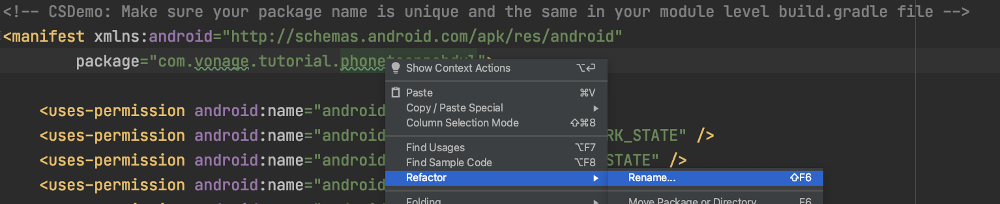
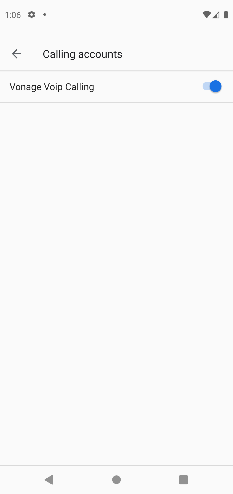
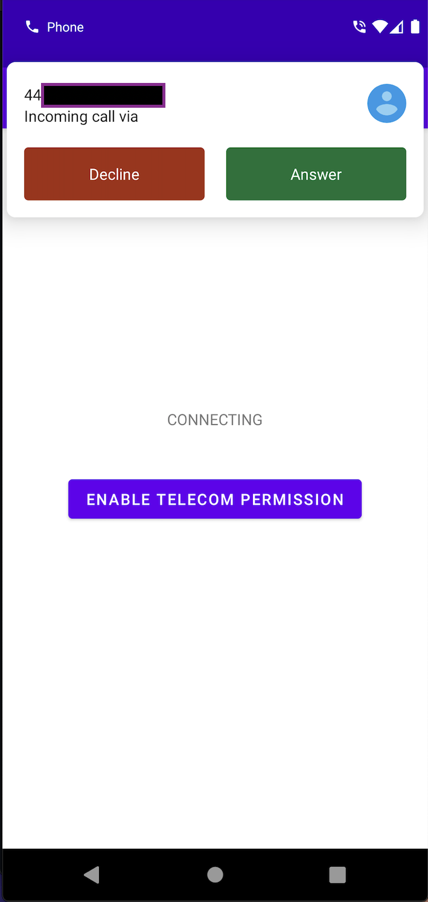
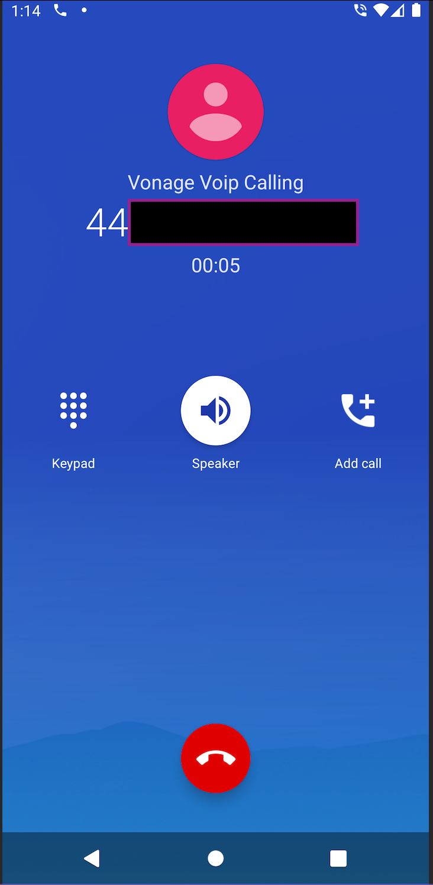

# Android Client SDK Push Notifications ConnectionService Sample

This is an Android Kotlin project that using the [Client SDK](https://developer.vonage.com/client-sdk/overview) to receive inbound calls from a phone with a [ConnectionService](https://developer.android.com/reference/android/telecom/ConnectionService) integration for push notifications.

## Welcome to Vonage

If you're new to Vonage, you can [sign up for a Vonage API account](https://dashboard.nexmo.com/sign-up?utm_source=DEV_REL&utm_medium=github&utm_campaign=) and get some free credit to get you started.

## Running the project

The push notifications in the project require set up with your Firebase account and your Vonage API account. See the [docs](https://developer.vonage.com/client-sdk/setup/set-up-push-notifications/android) for more information.

Clone the project to your computer, using the terminal:

`git clone git@github.com:Vonage-Community/sample-client_sdk-android-connection_service.git`

Open the project in Android studio and rename the app package by using the refactor tool in the `AndroidManifest.xml` file:

Then follow the steps in the [docs](https://developer.vonage.com/client-sdk/setup/set-up-push-notifications/android) to get your application registered with Firebase and Vonage.

Add your JWT to the `ClientManager` class then run the app. Click the button to enable the telecom permissions for this app:

Return to the app and login, this will register this device token with Vonage for push notifications. To handle push notifications correctly the app needs to not be logged in so run the app again and this time _do not_ log in. 

When you call your Vonage number you will see a banner if the device is unlocked:

When answer is clicked it will bring up the system UI:

## Getting Help

We love to hear from you so if you have questions, comments or find a bug in the project, let us know! You can either:

* Open an issue on this repository
* Tweet at us! We're [@VonageDev on Twitter](https://twitter.com/VonageDev)
* Or [join the Vonage Developer Community Slack](https://developer.nexmo.com/community/slack)

## Further Reading

* Check out the Developer Documentation at <https://developer.nexmo.com>